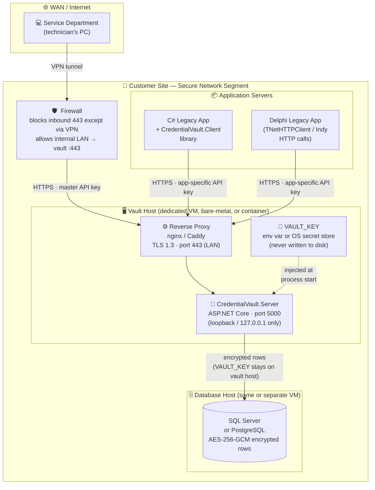

# Security – Credential Vault for Legacy Applications

A practical solution for securing plain-text credentials in legacy C# and Delphi applications.
Replaces plain-text passwords in `.config` and `.ini` files with **AES-256-GCM encrypted** values,
optionally backed by a central credential vault REST service.

---

## Problem Statement

Legacy applications store database and user credentials in plain text inside `.config` and `.ini`
files. This is a security risk. Requirements for the solution:

- **State-of-the-art encryption** for all credential values at rest.
- **Central storage** so that one vault serves multiple customers/applications.
- **Service department access** for troubleshooting without per-customer credential management.
- Compatible with existing **C# and Delphi** applications.

---

## Solution Overview

```
┌─────────────────────────────────────────────────────────────────────┐
│                    Customer Network (secure zone)                    │
│                                                                      │
│  ┌──────────────────┐     X-Api-Key     ┌──────────────────────┐   │
│  │  Legacy C# App   │──────────────────▶│  CredentialVault     │   │
│  │  (uses Client    │                   │  .Server             │   │
│  │   library)       │◀──────────────────│  (ASP.NET Core API)  │   │
│  └──────────────────┘  decrypted value  │                      │   │
│                                         │  Credentials stored  │   │
│  ┌──────────────────┐                   │  AES-256-GCM         │   │
│  │  Delphi App      │  HTTP/REST        │  encrypted in memory │   │
│  │  (plain HTTP     │──────────────────▶│  (DB-backed in prod) │   │
│  │   requests)      │                   └──────────────────────┘   │
│  └──────────────────┘                            ▲                  │
│                                                  │                  │
│  ┌──────────────────┐                   X-Api-Key (master key)      │
│  │  Service Dept.   │──────────────────────────────────────────────▶│
│  │  (browser /      │                                               │
│  │   curl)          │                                               │
│  └──────────────────┘                                               │
└─────────────────────────────────────────────────────────────────────┘
```

### Key design decisions

| Aspect | Decision |
|---|---|
| Encryption algorithm | **AES-256-GCM** (AEAD; provides confidentiality + integrity) |
| Key derivation | **PBKDF2-SHA256** with 600 000 iterations (OWASP 2023 recommendation) |
| Authentication | **API key** (X-Api-Key header); separate keys per application and for service dept. |
| Central vs. local | Central vault recommended; local file encryption supported as fallback/migration step |
| Delphi compatibility | Standard HTTP REST API – callable from any language |

---

## Hosting & Deployment

### On-Premises (Recommended)

The vault runs **inside the customer's secure network segment** — the same LAN as the legacy
applications. The service department connects over a VPN when remote access is needed.



> **Why inside the LAN?** The vault never needs to be public-facing. Keeping it on the internal
> network segment eliminates an entire class of internet-based attacks without requiring additional
> network hardening.

---

### Component Reference

| Component | Runs on | Listens on | Notes |
|---|---|---|---|
| **Reverse Proxy** (nginx / Caddy) | Vault Host | LAN :443 (TLS) | Handles TLS termination; forwards to localhost:5000 |
| **CredentialVault.Server** | Vault Host | 127.0.0.1 :5000 | Not exposed directly; only reachable via proxy |
| **Database** | DB Host (or same VM) | Internal only | Stores AES-256-GCM encrypted credential rows |
| **Legacy C# App** | App Server(s) | — | Uses CredentialVault.Client library |
| **Legacy Delphi App** | App Server(s) | — | Uses plain HTTP REST calls |
| **Service Dept.** | Technician PC | — | Connects via VPN; uses master API key |

---

### Firewall Rules

| Direction | Source | Destination | Port | Protocol | Purpose |
|---|---|---|---|---|---|
| Inbound | VPN range | Vault Host | 443 | TCP/HTTPS | Service dept. access |
| Inbound | App Servers (LAN) | Vault Host | 443 | TCP/HTTPS | App credential retrieval |
| Inbound | All | Vault Host | 5000 | TCP | **BLOCK** – internal only |
| Outbound | Vault Host | DB Host | 1433 / 5432 | TCP | DB connection |
| Inbound | All | DB Host | 1433 / 5432 | TCP | **BLOCK** – vault host only |

---

### Docker Compose Deployment

The simplest way to run the vault and its database together on a single host:

```yaml
# docker-compose.yml  –  place on the vault host
services:

  vault:
    image: mcr.microsoft.com/dotnet/aspnet:10.0
    build:
      context: .
      dockerfile: src/CredentialVault.Server/Dockerfile
    environment:
      # Vault key: generate with `ConfigMigrator generate-key`, store in a secrets manager
      - VAULT_KEY=${VAULT_KEY}
      - ASPNETCORE_URLS=http://+:5000
      - ConnectionStrings__VaultDb=Host=db;Database=vault;Username=vault;Password=${DB_PASSWORD}
    ports: []                        # NOT exposed to host; only reachable via proxy container
    depends_on:
      db:
        condition: service_healthy
    restart: unless-stopped

  proxy:
    image: caddy:2
    volumes:
      - ./Caddyfile:/etc/caddy/Caddyfile:ro
      - caddy_data:/data
    ports:
      - "443:443"                    # only port exposed to the LAN
    depends_on: [vault]
    restart: unless-stopped

  db:
    image: postgres:16
    environment:
      - POSTGRES_DB=vault
      - POSTGRES_USER=vault
      - POSTGRES_PASSWORD=${DB_PASSWORD}
    volumes:
      - db_data:/var/lib/postgresql/data
    healthcheck:
      test: ["CMD-SHELL", "pg_isready -U vault"]
      interval: 10s
      timeout: 5s
      retries: 5
    restart: unless-stopped

volumes:
  caddy_data:
  db_data:
```

```
# Caddyfile
vault.internal {
    reverse_proxy vault:5000
    tls internal          # Caddy auto-generates a LAN certificate
}
```

```bash
# Start
export VAULT_KEY="<base64-key>"
export DB_PASSWORD="<strong-random-password>"
docker compose up -d
```

> **Tip:** Store `VAULT_KEY` and `DB_PASSWORD` in a `.env` file that is **not** committed to
> source control, or inject them via your secrets manager (e.g. HashiCorp Vault, Azure Key Vault).

---

### Alternative: Cloud-Hosted

If the customer prefers a cloud deployment (Azure, AWS, GCP), the topology is identical — replace
the on-premises LAN with a **private VNet / VPC** and restrict access using security groups or
NSG rules. The vault should still **never** be reachable from the public internet.

| On-Premises component | Azure equivalent | AWS equivalent |
|---|---|---|
| VM / bare-metal | Azure VM or Container App | EC2 or ECS Fargate |
| Reverse proxy | Azure Application Gateway (internal) | Internal ALB |
| SQL Server / PostgreSQL | Azure SQL / Flexible Server | RDS |
| VAULT_KEY env var | Azure Key Vault reference | AWS Secrets Manager |
| VPN for service dept. | Azure VPN Gateway / Bastion | AWS Client VPN |

---

## Repository Structure

```
Security/
├── src/
│   ├── CredentialVault.Core/           # Encryption primitives (AES-256-GCM, PBKDF2)
│   │   ├── Encryption/
│   │   │   ├── AesGcmEncryptor.cs      # Encrypt/Decrypt with AES-256-GCM
│   │   │   └── SecretKeyDerivation.cs  # PBKDF2-SHA256 key derivation
│   │   └── Models/
│   │       ├── CredentialEntry.cs      # Vault entry model
│   │       └── CredentialDtos.cs       # Request/response DTOs
│   │
│   ├── CredentialVault.Server/         # ASP.NET Core REST API (the central vault)
│   │   ├── Controllers/
│   │   │   └── CredentialsController.cs
│   │   ├── Services/
│   │   │   ├── VaultStore.cs           # In-memory AES-256-GCM encrypted store
│   │   │   └── ApiKeyAuthentication.cs # API key auth handler + registry
│   │   └── Program.cs
│   │
│   ├── CredentialVault.Client/         # C# client library for consuming the vault
│   │   ├── Http/
│   │   │   ├── IVaultClient.cs         # Interface for easy mocking/testing
│   │   │   └── VaultHttpClient.cs      # HttpClient-based implementation
│   │   └── VaultClientServiceCollectionExtensions.cs
│   │
│   └── CredentialVault.ConfigMigrator/ # CLI tool to encrypt legacy config/ini files
│       └── Program.cs
│
└── tests/
    └── CredentialVault.Tests/
        ├── Core/                       # Unit tests for encryption primitives
        ├── Server/                     # Unit tests for VaultStore
        └── Integration/                # Integration tests for the REST API
```

---

## Quick Start

### 1. Generate a vault key

```bash
dotnet run --project src/CredentialVault.ConfigMigrator -- generate-key
```

Output:
```
AES-256 Key (Base64) - store this securely, e.g. as VAULT_KEY env var:
FQhcBPYHcv2PO2RcWR7GD1uhpOfEngiFDY9W/8bCjHE=

PBKDF2 salt for master-password derivation (Base64):
h0qcWgQkfeSA7fl2rogwikZZl4Dtcyn9CZhfB5gxjJw=
```

Store this key as an **environment variable** on the vault server host — never in source control.

### 2. Generate API keys

```bash
# One key per application + one master key for the service department
dotnet run --project src/CredentialVault.ConfigMigrator -- generate-api-key
```

### 3. Start the vault server

```bash
export VAULT_KEY="<base64-key-from-step-1>"

dotnet run --project src/CredentialVault.Server
```

Configure API keys in `appsettings.json` (or via environment / secrets manager):

```json
{
  "ApiKeys": [
    { "Name": "LegacyCrmApp",      "Key": "<app-api-key>",     "Role": "Application" },
    { "Name": "ServiceDepartment", "Key": "<service-api-key>", "Role": "ServiceDepartment" }
  ]
}
```

### 4. Store credentials

```bash
# Store a credential via the REST API
curl -X PUT https://vault.internal/api/credentials \
  -H "X-Api-Key: <app-api-key>" \
  -H "Content-Type: application/json" \
  -d '{"application":"CRM","key":"DatabasePassword","plainTextValue":"MySecret@123","description":"CRM DB password"}'
```

### 5. Retrieve credentials in a C# application

#### With the client library (recommended)

```csharp
// In your DI setup (e.g. Program.cs / Startup.cs)
services.AddCredentialVaultClient(
    vaultBaseUrl: "https://vault.internal",
    apiKey: configuration["VaultApiKey"]  // read from env or config
);

// Inject IVaultClient into your service
public class DatabaseFactory
{
    private readonly IVaultClient _vault;

    public DatabaseFactory(IVaultClient vault) => _vault = vault;

    public async Task<string> GetConnectionStringAsync()
    {
        return await _vault.GetCredentialAsync("CRM", "DatabasePassword")
            ?? throw new InvalidOperationException("Credential not found in vault.");
    }
}
```

#### Without DI (direct use)

```csharp
using var httpClient = new HttpClient { BaseAddress = new Uri("https://vault.internal/") };
httpClient.DefaultRequestHeaders.Add("X-Api-Key", "<app-api-key>");

var vaultClient = new VaultHttpClient(httpClient);
string password = await vaultClient.GetCredentialAsync("CRM", "DatabasePassword");
```

### 6. Retrieve credentials from Delphi

Since the vault is a plain REST API, Delphi applications can use any HTTP library:

```pascal
// Using Indy (TIdHTTP) or TNetHTTPClient
procedure TForm1.GetCredential;
var
  HTTP: TNetHTTPClient;
  Response: IHTTPResponse;
  JSON: TJSONObject;
begin
  HTTP := TNetHTTPClient.Create(nil);
  try
    HTTP.CustomHeaders['X-Api-Key'] := '<app-api-key>';
    Response := HTTP.Get('https://vault.internal/api/credentials/CRM/DatabasePassword');
    JSON := TJSONObject.ParseJSONValue(Response.ContentAsString) as TJSONObject;
    try
      ShowMessage(JSON.GetValue<string>('value'));
    finally
      JSON.Free;
    end;
  finally
    HTTP.Free;
  end;
end;
```

---

## Migrating Existing Config Files

Use the `ConfigMigrator` CLI to encrypt credentials in existing files **without** deploying the
vault server first. This is a migration step — afterwards, values can be loaded from the file
or moved to the vault.

### Encrypt an `.ini` file

```bash
dotnet run --project src/CredentialVault.ConfigMigrator -- encrypt settings.ini <base64-key>
```

Before:
```ini
[Database]
password=MySecret$Pass123!
apikey=prod-api-key-12345
```

After:
```ini
[Database]
password=ENC:cN9VdhI5IAJBrogVJv39C5kDHwYv/2RunBtyFZGzduxra2yp2wKYNCxjvqhn
apikey=ENC:DfjffPEhOTgnSrPJ+Wcj/qaSr4R94LMvEWvGiP8H7fpGFks4TOa9OV52d7n1iw==
```

A `.backup` copy of the original file is created automatically.

### Encrypt an `.config` file

```bash
dotnet run --project src/CredentialVault.ConfigMigrator -- encrypt App.config <base64-key>
```

Encrypts `password=`, `pwd=`, `secret=`, and `connectionString=` attribute values.

### Encrypt / decrypt a single value

```bash
dotnet run --project src/CredentialVault.ConfigMigrator -- encrypt-value "MyPassword" <key>
# → ENC:...

dotnet run --project src/CredentialVault.ConfigMigrator -- decrypt-value "ENC:..." <key>
# → MyPassword
```

---

## REST API Reference

All endpoints require the `X-Api-Key` header.

| Method | Path | Description |
|---|---|---|
| `PUT` | `/api/credentials` | Store (create or update) a credential |
| `GET` | `/api/credentials/{app}/{key}` | Retrieve a decrypted credential |
| `DELETE` | `/api/credentials/{app}/{key}` | Delete a credential |
| `GET` | `/api/credentials/{app}` | List credential keys for an app (no values) |
| `GET` | `/api/credentials` | List all credential keys (no values) |

---

## Security Considerations

### Key management

- The **vault key** (or master password) must be injected via the `VAULT_KEY` environment variable
  or a secrets manager (e.g. HashiCorp Vault, Azure Key Vault, AWS Secrets Manager).
- **Never** commit the vault key or API keys to source control.
- Rotate API keys periodically. Application keys should have `Role: Application`;
  the service department key should have `Role: ServiceDepartment`.

### Network security

- Deploy the vault server behind **HTTPS** (TLS 1.2+). Use a reverse proxy (nginx, Caddy) or
  configure Kestrel with a certificate.
- Restrict vault network access to the secure network segment where legacy applications run.
- The vault should **not** be reachable from the public internet.

### AES-256-GCM properties

- **256-bit key** — quantum-resistant in the near term.
- **GCM (Galois/Counter Mode)** — provides authenticated encryption; tampered ciphertexts are
  detected and rejected (throws `AuthenticationTagMismatchException`).
- **Random nonce per encryption** — the same plaintext produces different ciphertext each time,
  preventing pattern analysis.
- The stored format is: `[nonce (12 bytes)] [GCM tag (16 bytes)] [ciphertext (n bytes)]`,
  Base64-encoded with an `ENC:` prefix when stored in config/ini files.

### Service department access

The service department is issued a **master API key** with `Role: ServiceDepartment`. This key:
- Has access to all credentials across all applications via the listing endpoints.
- Can store and retrieve any credential for troubleshooting.
- Is kept in a secure password manager; not embedded in any application.

This approach means one master key works across **all customers** — no per-customer maintenance.
If a key is compromised, rotate only that key.

### Production hardening

The `VaultStore` is currently in-memory (credentials are lost on restart). For production:

1. Replace `VaultStore` with a **database-backed** implementation (SQL Server, PostgreSQL, SQLite).
2. The encrypted values can be stored safely in the database; the vault key stays only on the
   application server (environment variable or secrets manager).
3. Consider **mTLS** between applications and the vault for mutual authentication.

---

## Alternatives

The table below assesses each alternative against the four original requirements, then each option
is described in detail.

| Solution | Encryption at rest | Central storage | Service dept. access | C# + Delphi compatible | Self-hosted |
|---|:---:|:---:|:---:|:---:|:---:|
| **This project** (CredentialVault) | ✅ AES-256-GCM | ✅ | ✅ API key roles | ✅ | ✅ |
| **HashiCorp Vault** | ✅ AES-256-GCM / Transit | ✅ | ✅ Policies + tokens | ✅ REST API | ✅ |
| **CyberArk Conjur** (Community) | ✅ | ✅ | ✅ RBAC | ✅ REST API | ✅ |
| **Infisical** (self-hosted) | ✅ | ✅ | ✅ RBAC | ✅ REST API | ✅ |
| **Azure Key Vault** | ✅ FIPS 140-2 | ✅ | ✅ RBAC + access policies | ✅ REST / SDK | ☁️ cloud |
| **AWS Secrets Manager** | ✅ KMS-backed | ✅ | ✅ IAM policies | ✅ REST / SDK | ☁️ cloud |
| **Windows DPAPI** | ✅ (per-machine / per-user) | ❌ no central store | ❌ must access each machine | ✅ .NET API | ✅ |

---

### 1. HashiCorp Vault (Self-Hosted)

[HashiCorp Vault](https://www.vaultproject.io/) is the industry-standard open-source secrets manager.
It can be deployed on-premises and exposes a comprehensive REST API callable from any language.

**How it meets the requirements**

- **Encryption at rest** – Vault encrypts its storage backend with AES-256-GCM and can optionally
  integrate with an HSM for key protection.
- **Central storage** – a single Vault cluster serves all applications and customers via namespaces
  or mount paths.
- **Service department access** – fine-grained policies let the service team access any path without
  managing per-customer credentials; audit logging records every read.
- **C# + Delphi** – the [VaultSharp](https://github.com/rajanadar/VaultSharp) NuGet package wraps
  the API for C#; Delphi can call the same REST API with any HTTP library.

**Trade-offs vs. CredentialVault**

| Aspect | CredentialVault | HashiCorp Vault |
|---|---|---|
| Complexity | Low — single binary | High — HA cluster, unsealing ceremony |
| Features | Tailored to this use case | Dynamic secrets, PKI, SSH, audit log, … |
| License | MIT | BSL 1.1 (free for non-competing use) |
| Operational overhead | Minimal | Significant (init, unseal, renewal, upgrades) |

**Example – store and retrieve a secret**

```bash
# Store
vault kv put secret/crm/db password="MySecret@123"

# Retrieve (returns JSON)
vault kv get -field=password secret/crm/db
```

From Delphi or any HTTP client:

```
GET https://vault.internal:8200/v1/secret/data/crm/db
X-Vault-Token: <service-token>
```

---

### 2. CyberArk Conjur Community Edition (Self-Hosted)

[CyberArk Conjur](https://www.conjur.org/) is an open-source secrets manager designed for DevOps
and machine-identity scenarios. The Community Edition is free to self-host.

**How it meets the requirements**

- **Encryption at rest** – secrets are stored AES-256 encrypted in a PostgreSQL database.
- **Central storage** – one Conjur instance manages secrets for all applications.
- **Service department access** – RBAC roles let the service team retrieve any secret; full audit
  trail is included.
- **C# + Delphi** – official .NET SDK available; Delphi uses the REST API.

**Trade-offs vs. CredentialVault**

| Aspect | CredentialVault | Conjur Community |
|---|---|---|
| Setup | `dotnet run` | Docker Compose + initialisation scripts |
| Auth methods | API key | JWT, LDAP, Kubernetes, API key |
| Audit logging | Not built-in | Built-in |
| Support | Community / in-house | CyberArk community |

---

### 3. Infisical (Self-Hosted Open Source)

[Infisical](https://infisical.com/) is a modern, open-source secrets manager with a polished web
UI, CLI, and REST API. The self-hosted edition is free (MIT licence).

**How it meets the requirements**

- **Encryption at rest** – end-to-end AES-256-GCM encryption; the server never sees plaintext
  secrets (zero-knowledge model).
- **Central storage** – projects and environments organise secrets centrally.
- **Service department access** – machine identities with scoped token permissions; full audit log.
- **C# + Delphi** – official .NET SDK and universal REST API.

**Trade-offs vs. CredentialVault**

| Aspect | CredentialVault | Infisical |
|---|---|---|
| UI | REST API only | Full web dashboard |
| Secret versioning | Not built-in | Built-in |
| Setup | Single binary | Docker Compose (multiple services) |
| Open-source licence | MIT | MIT |

---

### 4. Azure Key Vault / AWS Secrets Manager (Cloud-Managed)

If the customer accepts a cloud dependency, the managed services from Azure and AWS eliminate all
operational overhead: no servers to run, patch, or back up.

**Azure Key Vault**

- Secrets stored with **FIPS 140-2 Level 2** HSMs.
- Service department access via Azure RBAC (`Key Vault Secrets User` role on the vault resource).
- C# via `Azure.Security.KeyVault.Secrets` NuGet; Delphi via REST with an Azure AD bearer token.

```csharp
var client = new SecretClient(new Uri("https://myvault.vault.azure.net/"),
                              new DefaultAzureCredential());
KeyVaultSecret secret = await client.GetSecretAsync("CRM--DatabasePassword");
string value = secret.Value;
```

**AWS Secrets Manager**

- Secrets encrypted with AWS KMS (AES-256).
- Service department access via IAM policies (`secretsmanager:GetSecretValue`).
- C# via `AWSSDK.SecretsManager` NuGet; Delphi via AWS Signature V4 REST API.

**Trade-offs vs. CredentialVault**

| Aspect | CredentialVault | Cloud KV |
|---|---|---|
| Data residency | On-premises | Cloud provider region |
| Cost | Hosting cost only | Per-secret / per-API-call pricing |
| Availability | Depends on your infra | SLA-backed (99.9 %+) |
| Delphi auth | Simple API key header | OAuth2 / SigV4 token exchange required |
| Works without internet | ✅ | ❌ |

---

### 5. Windows DPAPI + Encrypted Config Files (No Central Server)

The Windows Data Protection API (DPAPI) can encrypt values using the machine or user key managed
by Windows. This is the simplest option — no server needed — but it does **not** provide central
storage.

```csharp
// Encrypt
byte[] plain = Encoding.UTF8.GetBytes("MySecret@123");
byte[] cipher = ProtectedData.Protect(plain, null, DataProtectionScope.LocalMachine);
string encoded = Convert.ToBase64String(cipher);

// Decrypt
byte[] decoded = Convert.FromBase64String(encoded);
string value = Encoding.UTF8.GetString(
    ProtectedData.Unprotect(decoded, null, DataProtectionScope.LocalMachine));
```

**Why it doesn't fully meet the requirements**

| Requirement | DPAPI |
|---|---|
| Encryption at rest | ✅ (machine-bound) |
| Central storage | ❌ Each machine has its own key; credentials can't be shared |
| Service dept. access | ❌ Service team must log into each machine to decrypt |
| C# + Delphi | ⚠️ C# easy; Delphi requires CryptUnprotectData P/Invoke |

DPAPI is suitable as a **local fallback** (which CredentialVault's ConfigMigrator already provides
using a portable AES-256-GCM key) but cannot replace the central vault for multi-machine scenarios.

---

### Choosing a Solution

```
Start here
    │
    ▼
On-premises required?
    ├─ NO  ──▶  Azure Key Vault or AWS Secrets Manager
    │
    └─ YES
           │
           ▼
       Delphi apps need to authenticate with OAuth2 / complex token flows?
           ├─ NO  (simple API key is fine)
           │       │
           │       ▼
           │   Operational complexity acceptable?
           │       ├─ Minimal  ──▶  CredentialVault (this project)
           │       ├─ Medium   ──▶  Infisical (self-hosted, web UI)
           │       └─ High     ──▶  HashiCorp Vault or CyberArk Conjur
           │
           └─ YES (full enterprise PAM / dynamic secrets needed)
                   └──▶  HashiCorp Vault Enterprise or CyberArk PAS
```

> **Recommendation for this use-case:** CredentialVault is a good fit when you want a
> self-contained, easy-to-deploy solution with no additional infrastructure. If the customer
> already has HashiCorp Vault or Azure Key Vault deployed, use that instead — the
> `IVaultClient` interface in this project can be re-implemented against any backend.

---

## Running Tests

```bash
dotnet test
```

42 tests covering:
- AES-256-GCM encrypt/decrypt round-trips
- Key derivation with PBKDF2-SHA256
- VaultStore CRUD operations
- REST API integration (authentication, CRUD, listing)

---

## Building

```bash
dotnet build
```

